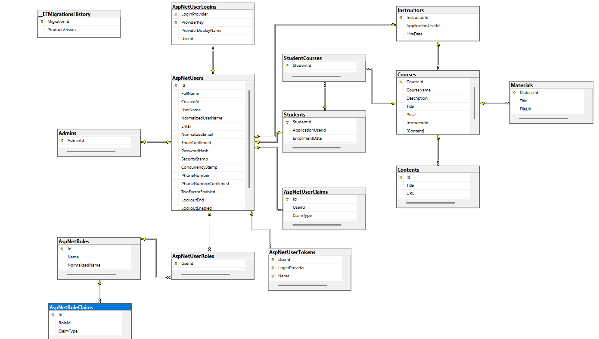

# SmartLMS - Student Course Management System

## Table of Contents

1. [Overview](#overview)  
2. [Features](#features)  
3. [Tech Stack](#tech-stack)  
4. [Folder Structure](#folder-structure)  
5. [Setup Instructions](#setup-instructions)  
6. [Database Design](#database-design)  
7. [API Documentation](#api-documentation)  
8. [UI](#ui)  
9. [Known Issues](#known-issues)  
10. [Contribution Guide](#contribution-guide)
11. [ Updatability & Scalability](#updatability-&-scalability)
12. [ Security](#security)
13. [About the Author](#about-the-author)

## Overview

SmartLMS is a full-stack MVC-based Learning Management System (LMS) built to facilitate online course sharing and enrollment. Unlike traditional LMS platforms tied to specific institutions, this system is designed as an open platform where any instructor can upload and manage their courses—pending approval from an admin. Once approved, students can browse available courses, register for the ones that interest them, and start learning.

 ## Features
### 🔒 Authentication & Authorization
Role-based access: Admin, Instructor, and Student

Secure registration and login for all users

### 👤 Admin Panel
View and manage all users

Approve or reject courses submitted by instructors

Manage platform content

### 👨‍🏫 Instructor Dashboard
Submit new courses (title, description, materials)

View status of submitted courses

Edit or remove their own courses (only before approval)

### 🎓 Student Interface
Browse available and approved courses

View course details before enrolling

Enroll in preferred courses

Access enrolled course content

### 📄 Course Management
Courses contain titles, descriptions, instructors, prices, materials and attached contents

contents may include text, video links, and downloadable files

### 🔎 Search & Filter
Filter courses by category or instructor

Search by keyword

## Tech Stack
- Frontend: HTML, CSS, JavaScript, Razor Views

- Backend: ASP.NET Core MVC (C#)

- Database: SQL Server (EF Core for ORM)

- Architecture: MVC (Model-View-Controller)

- Authentication: ASP.NET Identity

- Development Environment: Visual Studio, SQL Server Management Studio

## Folder Structure
LMS-Project/
  - Controllers/
    - CourseController.cs
    - AccountController.cs
    - AdminController.cs
    - StudentController.cs
    - HomeController.cs
  - Models/
    - Course.cs
    - Material.cs
    - Student.cs
    - Instructor.cs
    - Admin.cs
    - ApplicationUser.cs
  - Views/
    - Account/
      - Login.cshtml
      - Register.cshtml
    - Home/
      - Index.cshtml
      - About.cshtml
      - Contact.cshtml
      - Courses.cshtml
      - Privacy.cshtml
    - Shared/
      - _ViewImports.cshtml
      - _ViewStart.cshtml
  - wwwroot/
    - css/
    - js/
  - appsettings.json
  - Program.cs

## Setup Instructions

### Prerequisites
- .NET SDK 8.0
- Visual Studio 2022 or newer
- SQL Server 20 or later

### Steps
1. Clone the repo:
   ```bash
   git clone https://github.com/mohmadykhaled/project-LMS.git

2. Configure the Database
- Update the appsettings.json with your SQL Server connection string:
   ```bash
   "ConnectionStrings": {"DefaultConnection": "Server=.;Database=LMS_DB;Trusted_Connection=True;"}
- Apply the initial migration:
   ```bash
   Update-Database
3. Build and Run
- Open the solution in Visual Studio

- Set the main project as the startup project

- Press F5 or click Start to run the application

## Database Design
### Class Diagram:

## API Documentation
### 1. Admin APIs (from IAdminRepository.cs)
- User Management:
 - GET /api/admin/users - Get all users
 - GET /api/admin/users/{userId} - Get user by ID
-Course Management:
 - GET /api/admin/courses - Get all courses
 - GET /api/admin/courses/{courseId} - Get course by ID
 - POST /api/admin/courses - Create new course
 - PUT /api/admin/courses/{courseId} - Update course
 - DELETE /api/admin/courses/{courseId} - Delete course
- Analytics:
 - GET /api/admin/statistics/users - Get user statistics
 - GET /api/admin/statistics/courses - Get course statistics
- Role Management:
 - POST /api/admin/users/{userId}/roles - Assign role to user
 - DELETE /api/admin/users/{userId}/roles/{roleName} - Remove role from user
   
### 2. Instructor APIs (from IInstructorRepository.cs)
- Course Management:
 - POST /api/instructor/courses/submit - Submit course for approval
 - GET /api/instructor/{instructorId}/courses - Get instructor's courses
 - GET /api/instructor/user/{applicationUserId} - Get instructor by user ID
   
### 3. Home Controller Endpoints (from HomeController.cs)
- Public Pages:
 - GET / - Home page
 - GET /Home/Privacy - Privacy page
 - GET /Home/About - About page
 - GET /Home/Courses - Courses listing
 - GET /Home/Contact - Contact page
 - GET /Home/Error - Error handling
   
## UI
- Clean and responsive interface built with Razor Pages and Bootstrap

- Role-based navigation and access control

- Forms for login, registration, and course submission

- Course listing with filters and search functionality

- Admin dashboard for managing content and users
  
## Known Issues
- Instructors currently cannot edit a course once it is submitted for review.

- Course approval doesn't trigger a real-time notification (requires page refresh).

- Role management is hardcoded in some areas—refactoring to a more dynamic claims-based system is planned.

- Some UI elements may need improvement on smaller mobile screens.

## Contribution Guide
- Contributions are welcome! To get started:

    - Fork the repository
      
    - Create a new branch: feature/your-feature-name
    
    - Commit your changes with clear messages
  
    - Push to your fork and create a pull request

- Development Guidelines
  - Follow naming conventions (PascalCase for classes, camelCase for variables)
  
  - Ensure code is formatted and lint-free
  
  - Submit tests where possible

  - Clearly describe what your PR does and which issue it addresses

##  Updatability & Scalability
- Built using modular MVC design for easy component reuse

- Database interactions handled via Entity Framework Core for flexibility

- Identity-based roles make it easy to add new user types

- Future plans include support for certificate generation, mobile app, and real-time notifications

## Security
- ASP.NET Identity used for authentication and role-based access control

- Roles include: Admin, Instructor, and Student, implemented using IdentityRole

- User accounts extend IdentityUser for consistency with ASP.NET Core standards

- Passwords are hashed and stored securely by the Identity framework

- Middleware checks enforce access restrictions across the app

- Login attempts are validated with built-in Identity protections (lockout, email confirmation, etc.)
## About the Team
### Mohmady
### Abdelrazek
### Nancy
### Khalid
### Toka 
### Mohammed
  
  
